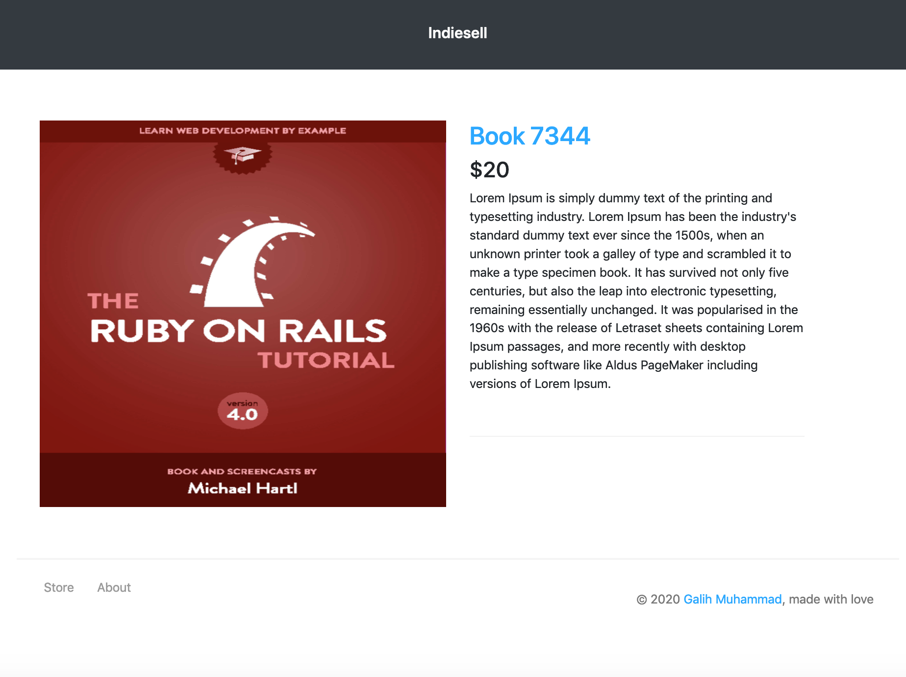

# Welcome
This is the starting point for all tutorial posts based on indiesell


## post/integrate-paypal-button

Before:


### STEPS

1. Introduce and work on the models
  - Add customer email field to purchases table
2. Integrate Paypal smart button to html views
  - Add script source from PAYPAL
  - Get sandbox Client ID
3. Setup the vue pack: store.js
  - Run ```yarn```
4. Setup the vue component: paypal button
  - Run ```yarn```
5. Setup the Paypal Capture endpoint to capture payment
  - Create endpoint
  - Hook the endpoint to the vue component and redirect user
6. Finishing: Enabling submitting CSRF token