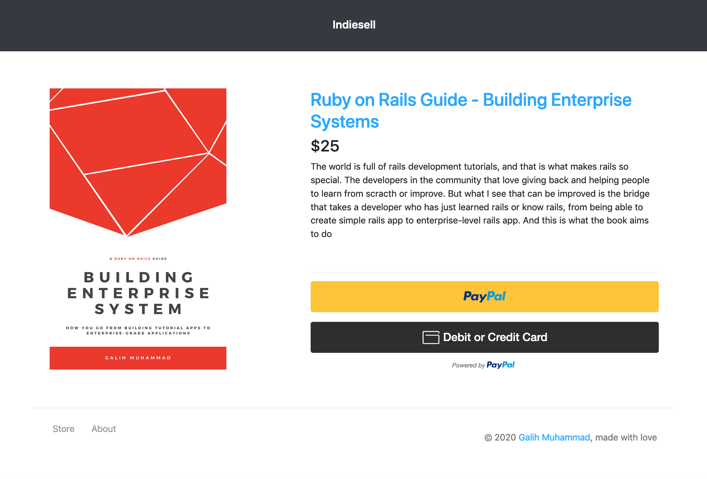
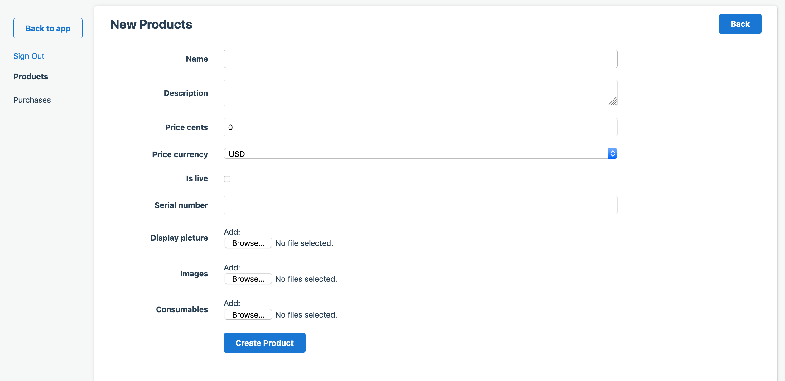
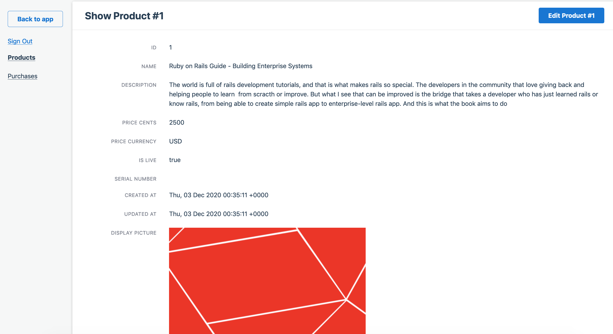

# Indiesell

[

A Ready-to-be used and simple to extend and customize online store for selling digital goods and downloadable contents.



(Very) heavily inspired by [Zipsell, made by Yang Yongfook,](https://github.com/yongfook/zipsell), Indiesell is intended to be clean, simple, maintanable, and well-tested. It has opinionated
structures but is built with extension and customization in mind.

Please use [GitHub Issues] to report bugs. If you have a question about the
library, you can ping me on [Twitter] for a quick, friendly chat

[GitHub Issues]: https://github.com/galliani/indiesell/issues
[Twitter]: https://twitter.com/_galihm

## Setup

Indiesell is a Rails app tested against Rails `>= 6.0` and Ruby `>= 2.6`, so make sure you have those setup and configured. For database, in development, test, and production, it uses the magnificent and simple sqlite3 as the database.


1. ```gem install bundler```
2. ```bundle install```
3. ```bundler exec rails db:create```
4. ```bundler exec rails db:migrate```
5. Copy the application.yml.example to application.yml. Then override the application.yml that you have just copied, primarily for these keys:
```yaml
default_currency: 'USD'
store_name:  ''
store_owner_name: ''
store_owner_email: '' 
store_owner_twitter: ''
store_host: 'domain-name.com'

file_expiry_hours: '24'
file_max_downloads: '10'

development:
  paypal_client_id: your_sandbox_paypal_client_id

test:
  paypal_client_id: your_sandbox_paypal_client_id

production:
  paypal_client_id: your_real_paypal_client_id
  azure_storage_account_name: ""
  azure_storage_access_KEY: ""
  azure_container: ""
```

6. Run ```rake db:seed``` to generate the admin user, based on the application.yml
7. Run ```yarn``` to check if you have nodejs already setup or not
7. Run ```bundle exec rspec``` to check if you have all the setup working correctly or not

## Use

You can test the demo by logging in the [Demo app Login page](https://indiesell-demo.herokuapp.com/admin) with:

email: 'indiesell.demo@gmail.com'
password: 'password'


### Creating product




## Testing Payment

Just click one of the buttons provided by Paypal, don't worry you will not be actually charged ^_^.

If you really want to be safe, you can just use this mock CC created in Paypal Developer dashboard:

```
card_number:    "4032033477038355"
card_exp_date:  "07/23"
card_cvv:       "152"
```

## Contributing

Please see [CONTRIBUTING.md].
Thank you, contributors!

[CONTRIBUTING.md]: /CONTRIBUTING.md

## License

Indiesell is copyright © 2020 Galih Muhammad. It is free software, and may be
redistributed under the terms specified in the [`LICENSE`] file.

[`LICENSE`]: /LICENSE

## About the author

Hi there! My name is  and here are my links if for some reason (I can't think of any, though), you have the need to reach me.

[linkedin](https://www.linkedin.com/in/galihm)
[Twitter](https://twitter.com/_galihm)
[devto](https://dev.to/galihm)
